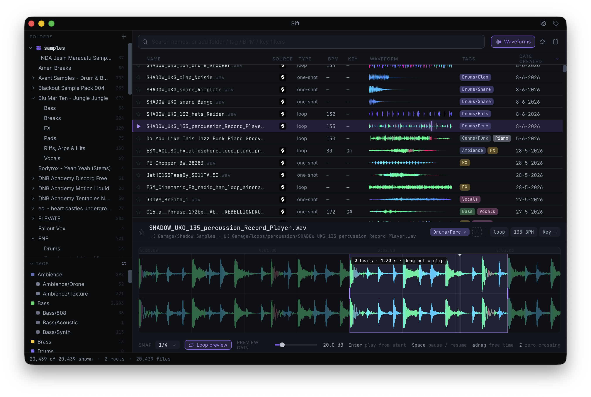

<p align="center">
  <picture>
    <source media="(prefers-color-scheme: dark)" srcset="assets/brand/readme-lockup-dark.png">
    <source media="(prefers-color-scheme: light)" srcset="assets/brand/readme-lockup-light.png">
    
  </picture>
</p>

<p align="center">
  Local desktop sample manager for producers and audio engineers.<br/>
  Browse, play, tag, and drag samples and clips into your DAW.
</p>

<p align="center">
  <a href="https://github.com/jeroen-meijer/sift/releases/latest/download/Sift_macOS_aarch64.dmg"></a>
  <a href="https://github.com/jeroen-meijer/sift/releases/latest/download/Sift_macOS_x64.dmg"></a>
  <a href="https://github.com/jeroen-meijer/sift/releases/latest/download/Sift_Windows_x64-setup.exe"></a>
</p>

<p align="center">
  
</p>

> [!WARNING]
> This project is a work in progress. While it is functional and ready to test, expect bugs and missing features. I am not responsible for any damage to your data that may be caused by this software.

> [!NOTE]
> Built mostly with AI agents. I'm a developer myself, but Tauri and web aren't my usual stack, and I like to use whatever helps me ship tools I want to exist. While I'm not looking for criticism on agent-assisted code, any bug reports, ideas and feedback to improve Sift are more than welcome.

## Features

- 📁 **Browse:** Large local libraries across multiple folders
- 🎧 **Preview:** Instantly listen to samples while you browse
- 🔎 **Search:** Name, tags, BPM, key, type, and folder *(⚠️ Work in progress)*
- 🖱️ **Drag:** Full files or a waveform clip into a DAW
- 🏷️ **Tag:** Favorite or tag samples, and create custom tags
- 🎼 **Analyze:** BPM, key, loop/one-shot, suggested tags in the background
- 🔗 **Integrations:** Integrates with 3rd party tools like [Splice](https://splice.com/) to automatically set BPM and key
- 📄 **Formats:** WAV, AIFF, FLAC, MP3, AAC/M4A, OGG, Opus

## Build from source

Needs Bun, Rust nightly, and Xcode Command Line Tools on macOS.

```bash
bun install
bun run tauri:dev
```

Add a sample folder, then browse and play.

Lint, test, release, and contributor conventions: [AGENTS.md](AGENTS.md).
Docs map for agents and maintainers: [docs/README.md](docs/README.md).
